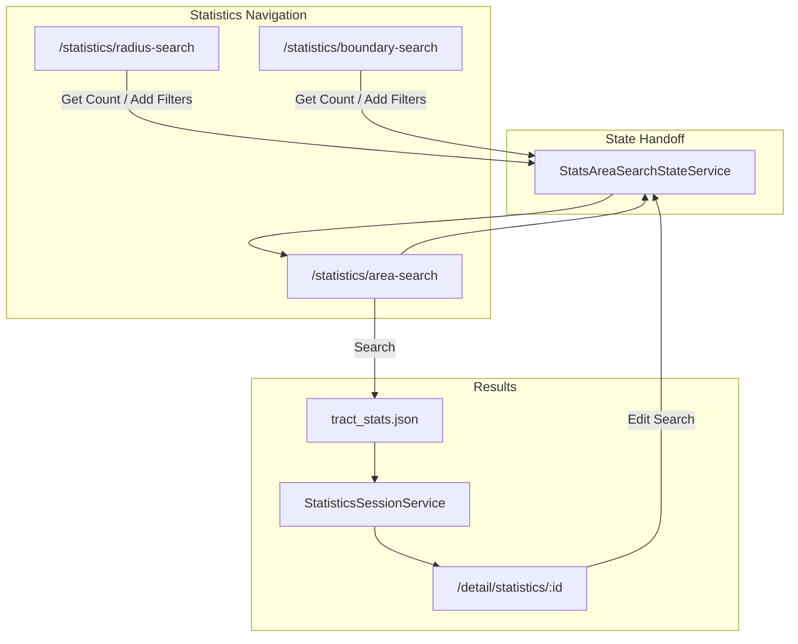

# Title Toolbox — Feature Inventory

This document lists features implemented in the project based on routes, navigation, services, and page components. Items marked **(recent)** were added or significantly expanded in the Statistics / stats-area-search work from this development effort.

---

## 1. Authentication and public entry

| Feature | Route / entry | Details |
|---------|---------------|---------|
| **Home** | `/` | White-label landing page via `VerticalService` (banner, branding). |
| **Login** | `/login` | Email/password auth; stores TbUser, TTBSID/stk session; supports `returnUrl`. |
| **MFA** | Embedded in login | Phone registration + OTP verification sub-flows. |
| **Session re-login** | Global modal | `LoginModalComponent` opens on 401/expired session via `SessionExpiredService`. |
| **Auth guards** | All authenticated routes | `authGuard`, `publicGuard`; admin routes use `adminAgenciesGuard` / `adminOfficesGuard`. |

---

## 2. App shell and global UI

| Feature | Entry | Details |
|---------|-------|---------|
| **Authenticated layout** | All logged-in routes | Collapsible sidebar, router outlet, global modals host. |
| **Sidebar navigation** | [`navigation.config.ts`](src/app/core/config/navigation.config.ts) | Dashboard, Farming, Statistics, placeholders; Settings (Theme, Logout). |
| **Vertical / white-label** | `VerticalService` | Tenant API origin, logos, support phone, feature flags (e.g. `statistics_hide`). |
| **Theme picker** | Settings → Theme | `ThemeModalComponent` — light/dark/main variant and font family. |
| **Design system** | `src/app/shared/components` | Reusable Button, Card, Input, Select, Alert, Modal, DataTable, form controls. |

---

## 3. Dashboard and account

| Feature | Route | Details |
|---------|-------|---------|
| **Dashboard hub** | `/dashboard` | Post-login home with wallet, subscription, and tabbed sections. |
| **Wallet / buy credit** | Dashboard card | `WalletService` balance; links to credit purchase via Pay Now. |
| **Subscription management** | Dashboard card | Plans, billing history, cancel subscription (`SubscriptionService`). |
| **Account settings** | Dashboard tab | Email notification toggles (farm email, BCC). |
| **Account information** | Dashboard tab | Profile edit, password change, profile picture, rep summary. |
| **Download history** | Dashboard tab | Usage/download report with print (`UserUsageService`, `UsageReportTableComponent`). |
| **Purchase history** | Dashboard tab | Past purchases with search and status badges. |

---

## 4. Property search (global modal)

| Feature | Entry | Details |
|---------|-------|---------|
| **Property Search modal** | Sidebar action | Address / Owner / Parcel tabs; Smarty autocomplete; county lookup. |
| **Search history** | In modal | Recent searches persisted locally. |
| **Results** | `/detail/search/:sessionId` | `PropertySearchSessionService` → `SearchDetailContext` → map + table. |

---

## 5. Farming (lead prospecting)

### Map-based search

| Feature | Route | Details |
|---------|-------|---------|
| **Radius search** | `/farming/radius-search` | OpenLayers map; draw circle; address/parcel lookup on map. |
| **Boundary search** | `/farming/boundary-search` | Same map UI; polygon draw mode. |
| **Get Count / Add Filters** | From map | Passes geometry via `AreaSearchStateService` → `/farming/area-search`. |

### Area search (advanced)

| Feature | Route | Details |
|---------|-------|---------|
| **Area Search page** | `/farming/area-search` | Full-page advanced search (not modal). |
| **Dynamic field groups** | Area search | Tabbed field groups from API metadata; premier/OAF accordions. |
| **Field types** | Shared widgets | Choice, multi-select, tree, range, wildcard, geometry, contact, etc. |
| **Get Count** | Area search footer | Runs `AreaSearchService` count; shows result count and payment gate. |
| **Pay Now** | Area search | `PayNowModalService` for paid record access; wallet integration. |
| **Save / Share search** | Modals | Save named query; share via email. |
| **Recent & common queries** | Side panel | Local recent (20 max) + office common queries from API. |
| **Criteria chips** | Area search | Active filters displayed as chips. |
| **Geometry preview** | Area search | Small map preview when geometry from radius/boundary. |
| **Results** | `/detail/query/:sessionId` | `AreaSearchSessionService` → `QueryDetailContext`. |

### Saved data

| Feature | Route | Details |
|---------|-------|---------|
| **Saved Farms** | `/farming/saved-farms` | Tabs: Main, Phone/Email lookup, DLA, Risk Score; map+table; open farm detail. |
| **Saved Searches** | `/farming/saved-searches` | List, rename, delete, reopen in area search. |
| **Saved Net Sheets** | `/farming/saved-net-sheets` | List, delete, search. |

---

## 6. Statistics (tract analytics) — **(recent)**

### Navigation and map

| Feature | Route | Details |
|---------|-------|---------|
| **Statistics sidebar group** | Nav | Radius, Boundary, Area Search; hidden when `statistics_hide` vertical flag is set. |
| **Statistics radius search** | `/statistics/radius-search` | Reuses `FarmingComponent` with `searchContext: 'statistics'`. |
| **Statistics boundary search** | `/statistics/boundary-search` | Polygon mode; same statistics context. |
| **Get Count / Add Filters** | From stats map | `StatsAreaSearchStateService` → `/statistics/area-search` (with optional auto-submit). |

### Statistics area search page — **(recent)**

| Feature | Route | Details |
|---------|-------|---------|
| **Stats Area Search** | `/statistics/area-search` | Full-page component (mirrors farming area-search pattern, not modal). |
| **Form fields** | Stats area search | State, county, city/zip, property types, area type, range filters (# homes, avg price, turnover, NOO ratio, avg years owned). |
| **Geometry mode** | Stats area search | County/city/zip disabled when geometry from map; state from reverse geocode. |
| **Edit search** | From results toolbar | Pre-fills form from session via state service + `?edit=true`. |
| **API** | `tract_stats.json` | [`StatsAreaSearchService`](src/app/core/services/stats-area-search.service.ts) posts payload, parses tract rows. |
| **UI styling** | Stats area search | Uses `AreaSearchControlStyles` (text-sm controls, chip multiselect, area-search footer buttons). |

### Statistics results — **(recent)**

| Feature | Route | Details |
|---------|-------|---------|
| **Statistics detail** | `/detail/statistics/:sessionId` | `StatisticsSessionService` → `StatisticsDetailContext`. |
| **Tract table** | Detail page | Columns: #, Group, City, Zip, Turn Over, # Homes, Total Sales, Avg Price, Avg Yr Owned, NOO Ratio. |
| **Map pins** | Detail table/map | `#` column uses map-pin variant; markers from tract `geo` coordinates. |
| **Actions column** | Detail table | Select button, gear menu (Area Search action), bulk exclude tracts. |
| **Export CSV** | Toolbar | Client-side CSV download of tract rows. |
| **Edit Search** | Toolbar | Reopens `/statistics/area-search` with saved criteria. |
| **Client filters** | Detail toolbar | Search text + field filter within tract results. |
| **Session expiry** | On reload | Redirects to `/statistics/radius-search` if session lost. |

---

## 7. Unified detail page (map + table pipeline)

| Source | Route pattern | Details |
|--------|---------------|---------|
| **Property search** | `/detail/search/:id` | Property markers; full property column set; row actions (TRIO profile, net sheet, etc.). |
| **Area search query** | `/detail/query/:id` | Criteria chips; save/share/export overflow; include/exclude bulk. |
| **Saved farm** | `/detail/farm/:id` | Farm filter dropdown; exclude properties; export menus. |
| **Statistics** | `/detail/statistics/:id` | Tract columns; Export + Edit Search toolbar **(recent)**. |

**Shared detail capabilities:**
- `MapTablePipelineComponent` — map-only / list-only / split view
- `MapTableSyncService` + `OlMapComponent` — geometry + markers
- `DataTableComponent` — sort, paginate, selection, row actions
- Toolbar: Back, Refresh, Filters, source-specific actions
- Export menus (farm/query — many formats; statistics — CSV only for now)

---

## 8. Payment and billing

| Feature | Entry | Details |
|---------|-------|---------|
| **Pay Now modal** | Global host | Multi-step: billing confirm, saved cards, new card, credit top-up. |
| **Wallet** | Dashboard + pay flows | Credit balance fetch/cache. |
| **Subscription** | Dashboard | Active plans, cancellation. |
| **Payment API** | `PaymentService` | Recs purchase, credit purchase, error parsing. |

---

## 9. Admin

| Feature | Route | Details |
|---------|-------|---------|
| **Admin users** | `/admin/users` | User pipeline table; search/filter; permission-gated actions. |
| **Admin agencies** | `/admin/agencies` | Agency management (guard-gated). |
| **Admin offices** | `/admin/offices` | Office table; target-office switching. |
| **Order history** | `/manage-reports/order-history` | Report order listing (also on dashboard). |

Admin panels also appear as tabs on `/dashboard` (permission-based visibility).

---

## 10. Placeholders and not yet implemented

| Item | Status |
|------|--------|
| **Buyer Cost Estimate** | `/buyer-cost-estimate` — placeholder page |
| **Daily Lead Alerts** | `/daily-lead-alerts` — placeholder; nav badge "NEW" |
| **High Volume Search** | Nav label only — no route |
| **123 search** | Nav label only — no route |
| **Query/Farm export actions** | UI present; many show "coming soon" notice |
| **Statistics row action "Area Search"** | Menu item present; handler stubbed |
| **Manage Account standalone routes** | Defined in nav config but not in `app.routes.ts` (tabs live on dashboard only) |

---

## 11. Core platform (under the hood)

- **API layer** — `ApiService` with TTB session (TTBSID), vertical-aware base URL, legacy JSON envelopes
- **Interceptors** — session cookie/query, unauthorized handling, partner key
- **Map stack** — CDN-loaded OpenLayers + Google Maps; draw, markers, popups, fit bounds
- **Session pattern** — In-memory sessions for query, search, statistics (survive navigation, not page refresh)
- **Detail context pattern** — Pluggable loaders per `source` type for one detail page component

---

## Summary by area

| Area | Maturity |
|------|----------|
| Auth + shell | Complete |
| Dashboard / account | Complete |
| Property search modal | Complete |
| Farming (map + area search + saved lists) | Complete |
| Statistics (map + area search + results) | **Recently built; core flow complete** |
| Detail page (4 sources) | Complete; export/actions vary by source |
| Payment | Complete |
| Admin | Complete (agencies shell) |
| Placeholders | Buyer Cost Estimate, Daily Lead Alerts |
